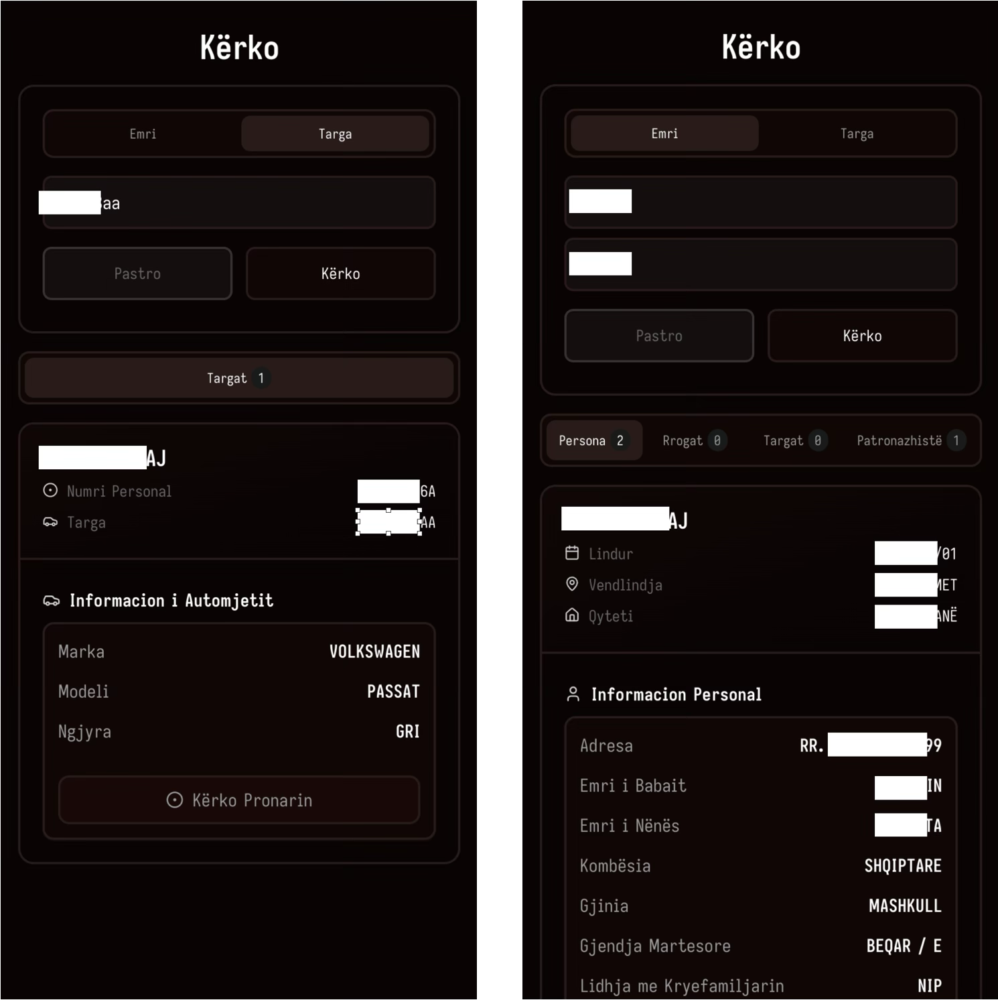

# Kërko

A modern search platform offering unified access to various Albanian public record databases through a streamlined web interface.
Built with **.NET 9** and **Next.js 15**.

**Database Size:** 1.1GB+ of indexed and searchable records

**Data Sources:** Includes leaked datasets such as those from the [2021 data breach](https://www.tiranatimes.com/massive-data-breach-exposes-wage-and-personal-info-of-more-than-637000-residents/)
> ⚠️ **Note:** No Data is included in this repository.



## 🌐 API Endpoints

### Public Endpoints

* `GET /api/kerko?emri={name}&mbiemri={surname}` - Search by name
* `GET /api/targat?numriTarges={plateNumber}` - Search by license plate
* `GET /api/health` - Health check

### Admin Endpoints (API Key Required)

* `GET /api/search-logs` - View search activity logs
* `GET /api/db-status` - Database status information

## 🚀 Tech Stack

**Frontend:** Next.js 15, TypeScript, Tailwind CSS, Shadcn UI, Framer Motion  
**Backend:** .NET 9, Entity Framework Core, SQLite  
**Features:** Rate limiting, CORS, Swagger API, Docker support

```text
┌──────────────┐      ┌──────────────┐      ┌────────────┐
│   Frontend   │◄──►│   Backend    │◄──►│  Database  │
│  Next.js 15  │      │  .NET 9 API  │      │  SQLite    │
└──────────────┘      └──────────────┘      └────────────┘

kerko/
├── frontend/                 # Next.js 15 application
│   ├── src/app/              # Pages and layouts
│   ├── src/components/       # React components
│   └── src/types/            # TypeScript definitions
│
├── backend/                  # .NET 9 Web API
│   └── Kerko/                # Main API project
│       ├── Controllers/      # API endpoints
│       ├── Models/           # Data models
│       ├── Services/         # Business logic
│       └── Infrastructure/   # Database context
│
└── README.md
```
