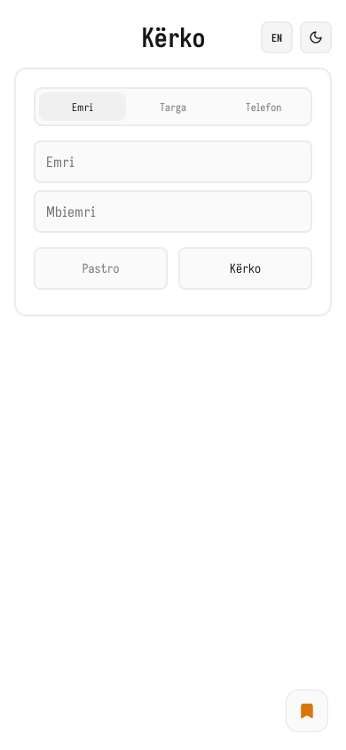
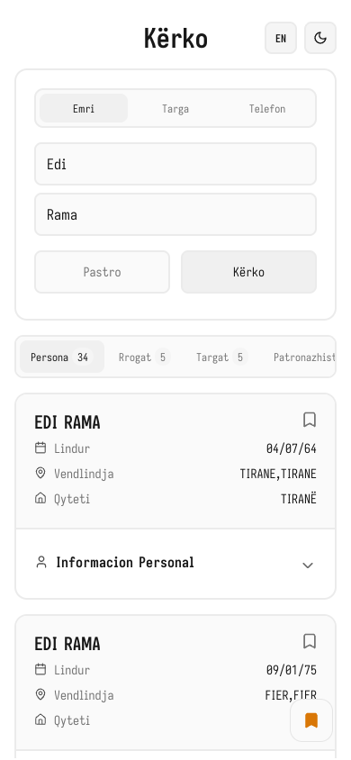
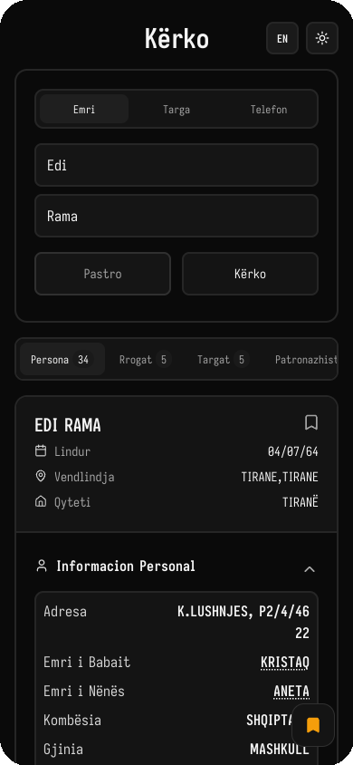

# Kerko

A search platform for Albanian public record databases.

**Stack:** .NET 10 (ASP.NET Core) + Next.js 15 (React 19) + SQLite
**Database:** 1.1GB+ of indexed, read-only records across 4 tables

**Data Sources:** Includes leaked datasets such as those from the [2021 data breach](https://www.tiranatimes.com/massive-data-breach-exposes-wage-and-personal-info-of-more-than-637000-residents/).
No data is included in this repository.

## Screenshots

<p align="center">
  
  
  
</p>

## Search types

| Endpoint | Description |
|----------|-------------|
| `/api/kerko` | Search by first + last name across all 4 tables (Person, Rrogat, Targat, Patronazhist) |
| `/api/targat` | Search by license plate number |
| `/api/telefon` | Search by phone number |
| `/api/health` | Health check with DB connectivity verification |

Albanian diacritics (c/e) are normalized so searching "kuci" finds "Kuci".

## Local development

### Prerequisites
- .NET 10 SDK
- Node.js 22+

### Backend
```bash
cd backend/Kerko
dotnet restore
dotnet run
```
Runs on `http://localhost:5000`. Requires a SQLite database at the path configured in `appsettings.json`.

### Frontend
```bash
cd frontend
npm install
npm run dev
```
Runs on `http://localhost:3000`. Set `NEXT_PUBLIC_API_URL` to point to the backend.

### Tests
```bash
cd backend
dotnet test
```
54 NUnit integration tests covering diacritic normalization, prefix search, pagination, input validation, and boundary clamping.

## Deployment

- **Frontend:** Vercel (auto-deploys from main) at `kerko.vercel.app`
- **Backend:** Docker on EC2 (t4g.micro, eu-central-1), HTTPS via API Gateway
- **CI/CD:** GitHub Actions builds, tests, and deploys via SSH on push to main
